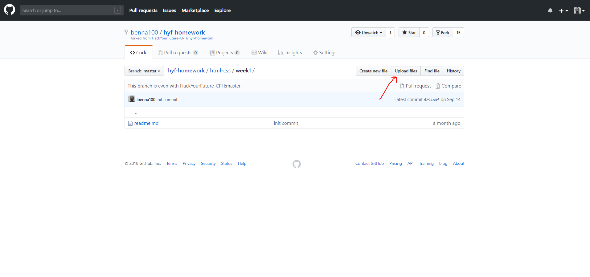
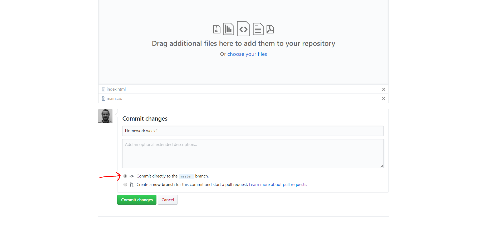

## Homework Week 1

## Step 1: Read and watch
#### Good learning practices
<br>
Before you start check out this [video](http://www.learningscientists.org/videos/) and/or this [article](https://www.cultofpedagogy.com/learning-strategies/) about good learning practices.

#### HTML5
Read about [HTML5](https://developer.mozilla.org/en-US/docs/Web/Guide/HTML/HTML5)

#### CSS:
- [CSS reference](http://cssreference.io/)
- [MDN - Introduction to CSS layout](https://developer.mozilla.org/en-US/docs/Learn/CSS/CSS_layout/Introduction)
- [CSS-tricks - CSS Properties](https://css-tricks.com/almanac/properties/)
- [MDN - CSS box model](https://developer.mozilla.org/en-US/docs/Web/CSS/CSS_Box_Model/Introduction_to_the_CSS_box_model)


## Step 2: Assignment
 - Make your own online CV:
    - One page
    - Two files: HTML and CSS
    - Include the following (you don't have to put any real personal information):
        - Your contact info
        - A picture 
        - A few lines about who you are
        - Work experience (from most recent to oldest)
        - Education (from most recent to oldest)
    - Include the following:
        - Different types of headings (`<h1>`, `<h2>`)
        - A list (`<ul>`). In this list include the _learning strategies_ you used making your resume. Also include some of the resources/references, this can be documentation/video etc, that where helpful.
        - Another list (`<ul>`). In this list you include the most important platforms/resources where you can find all hyf related information.
        - ``
        - `<p>`
        - Some CSS properties: `margin`, `padding`
        - Make sure that you page looks nice, and that your text is readable & accessible (ARIA)
    - BEFORE you hand it in, read the [Style guide](http://www.w3schools.com/html/html5_syntax.asp) and check your files (you can also use the [HTML validator](https://validator.w3.org)).

## Hand in Homework:
Check this [video](https://youtu.be/ew60RFIfut0) that explains how to hand in homework. Dont forget to post your homework to slack! You can also follow the points below.

1. Go to [hyf-homework-template repo](https://github.com/HackYourFuture-CPH/hyf-homework-template)
2. Click on the `Clone or download` button, choose `Download ZIP`
3. Unzip the repo on your local computer
4. Go to https://github.com/new In the `Repository name` write EXACTLY `hyf-homework`
5. Click on the `Upload new files` link
6. Drag and drop the contents of the hyf-homework-template repo
7. In the commit message write `Init commit` and press the `Commit changes` button
8. We have now created the structure for handing in homework, lets add our homework!
9. The files that you have created for the homework now needs to be uploaded to the hyf-homework repository. Start by going to the relevant folder: hyf-homework/html-css/week1<br> Now click the upload button.<br> 
10. Choose the files to upload (or drag and drop them), write a commit title and select the "Commit directly to the ```master``` branch."
 now press the "Commit changes" button.
1. If you need to change anything in the files, simply press the upload button and upload the changed file/files with a commit message. 
1. Post your index.html file on your classes slack channel in this format: https://htmlpreview.github.io/?https://github.com/YOUR_ACCOUNT/hyf-homework/blob/master/html-css/week1/index.html
1. Congratulations you have now handed in the homework 🎉! 

You are now done with the first homework at Hack Your Future. You should be proud of yourself!<br><br> 

