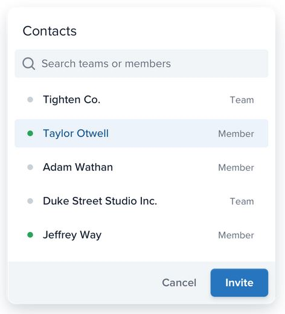
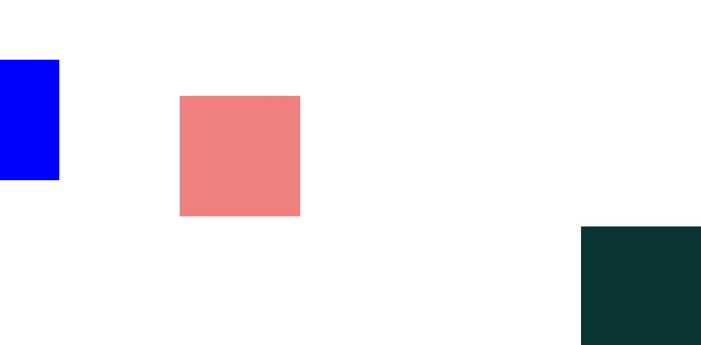
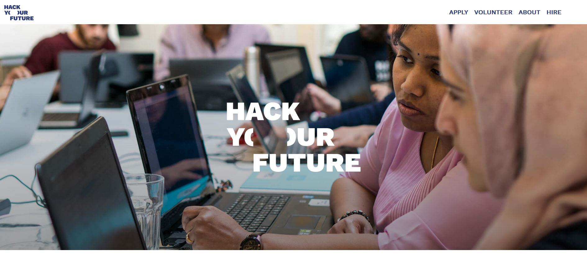
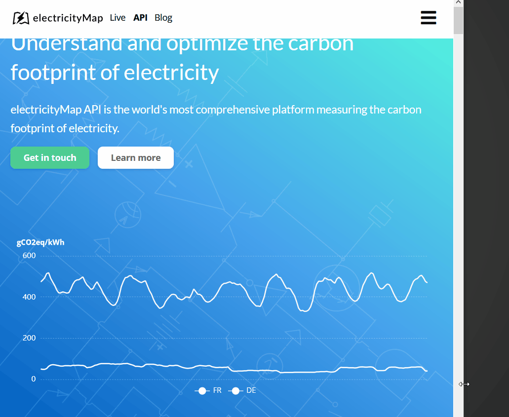

# Lesson plan
```
> Focus on having lots of in class exercises.

> DONT teach everything, let the students investigate topics on their own aswell!

> Focus on how to read documentation, google answers and google errors!!

> Teach towards the students being able to solve the homework
```

---

 - [ ] Student presentations
 - [ ] Last week recap and questions
 - [ ] Layout - [why is it important](#why-is-positioning-important)
      - [ ] Talk a little about flow (determines layout)
        - [ ] Block flow (on top of each other bottom to top)
        - [ ] inline flow (like text flows left to right)
    - [ ] Positioning (static, relative, absolute, fixed)
      - [ ] [Code inspiration](#position-boxes)
      - [ ] [Exercise 1](#positioning)
    - [ ] Floating (live coding, no exercise)
    - [ ] Flexbox
      - [ ] [Code inspiration](#flexbox-positioning)
      - [ ] `Container, flex-direction, flex-wrap, flex-grow, flex-shrink, justify-content, align-items`
      - [ ] [Exercise 2](#flexbox)
    - [ ] Centering stuff (vertically and horizontally)
      - [ ] `margin: 0 auto;`
      - [ ] `left:50%; transform: translate(-50%);`
 - [ ] Responsive web development - why?
   - [ ] Show https://www.soudfa.com/ as example of what happens on different devices
   - [ ] [Code inspiration](#responsive-development)
   - [ ] Mobile first development
     - [ ] Focus on what matters
     - [ ] Web is blockbased better for mobile. Special case is desktop!
    - [ ] Media queries
      - [ ] Only when it makes sense! Dont use predefined widths
      - [ ] `max-width`, `min-width`
    - [ ] [Exercise](#responsive)
    - [ ] If time relative measurements (%, (r)em)
 - [ ] How to work with the inspector

# Code inspiration

## Why is positioning important


## Position boxes

```html
<head>
  <link rel="stylesheet" href="main.css" />
  <style>
    .box {
      width: 100px;
      height: 100px;
    }
    .purple {
      background-color: purple;
    }
    .light-grey {
      background-color: lightgray;
    }
    .dark-grey {
      background-color: darkgray;
    }
    .static {
      /* default */
      position: static;
      left: 100px;
    }
    .relative {
      position: relative;
      /* Increasing the distance upwards from the bottom
     */
      bottom: 100px;
    }
    .wrapper {
      position: relative;
    }
    .absolute {
      /* taken out of flow */
      position: absolute;
      top: 0px;
    }
    .float {
      /* taken out of flow like absolute */
      float: left;
    }
  </style>
</head>
<body>
  <div class="purple box relative">test</div>
  <div class="wrapper light-grey">
    <div class="absolute box dark-grey"></div>
  </div>
</body>
```

## Flexbox positioning

[Code this bad boy](#why-is-positioning-important)

```html
<head>
  <style></style>
</head>
<section class="contacts">
  <h1>
    Contacts
  </h1>
  <input type="text" />
  <ul>
    <li>
      <div clas="green-dot"></div>
      <div>taylor Otwell</div>
      <div>Team</div>
    </li>
    <li>
      <div clas="green-dot"></div>
      <div>taylor Otwell</div>
      <div>Team</div>
    </li>
    <li>
      <div clas="green-dot"></div>
      <div>taylor Otwell</div>
      <div>Team</div>
    </li>
  </ul>
  <div class="wrapper">
    <button>Cancel</button>
    <button>Invite</button>
  </div>
</section>

```

## Responsive development
```html
<head>
  <style>
    section.responsive {
      max-width: 700px;
      margin: 0 auto;
      text-align: center;
    }

    ul {
      list-style-type: none;
      margin: 0;
      padding: 0;
    }

    @media screen and (min-width: 350px) {
      ul {
        display: flex;
      }
    }

    ul > li {
      flex-grow: 0;
      margin-bottom: 12px;
      height: 100px;
      background-color: aqua;
    }

    @media screen and (min-width: 350px) {
      ul > li {
        width: 25%;
        margin-right: 12px;
      }
    }

    @media screen and (min-width: 500px) {
      ul > li {
        width: 25%;
        margin-right: 24px;
      }
    }

    ul > li:last-child {
      margin-right: 0px;
    }
  </style>
</head>
<body>
  <section class="responsive">
    <h1>Welcome to HackYourFuture Corp®</h1>
    <h2>Totally not evil!</h2>
    <ul>
      <li></li>
      <li></li>
      <li></li>
      <li></li>
    </ul>
  </section>
</body>

```

# Exercises

## positioning

Using the template in [here](assest/../assets/exercise-template/positioning), fix the following tasks

1. The first box should be positioned 100px left of its original position.
2. The second box should be positioned 30px down and 100 right to the wrapper div.
3. The third box should be positioned fixed in the bottom right corner. 

The result should look like this:



*Todo: make a positioning exercise that is more real world*

## Flexbox

Code the layout for this image using the [template found here](assets/exercise-template/flex.box) 



## Responsive

Create this responsive section, where two blocks go from being on top of each other to side to sige. Focus on the layout changes, not on the colors, fonts etc. Use the [template found here](assets/exercise-template/responsive)




