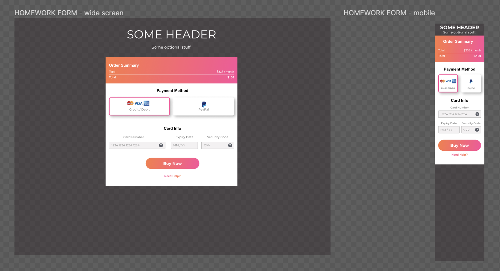

# Homework Week 3

## Warmup

Finish the class exercise (the CLASS EXERCISE FORM in the figma file). Make sure to make the form responsive!

Design file: [figma](https://www.figma.com/file/p0EjktmcYDCkRAqLhMOCV0/HTML%2FCSS-week3?node-id=0%3A1&t=SO0wI0YVRHM6UFHg-0)

## Main task

The task is to recreate a form in HTML and CSS, while following the design file (the HOMEWORK FORM in the figma file). You should focus on using the right HTML form widgets for the job, applying the general layout. Evidently, the form should be [responsive](https://developer.mozilla.org/en-US/docs/Learn/CSS/CSS_layout/Responsive_Design), as per the mobile layout design that is provided. The form should also have [validation](https://developer.mozilla.org/en-US/docs/Learn/Forms/Form_validation) - see the minimal requirements [below](#validation).

Design file: [figma](https://www.figma.com/file/p0EjktmcYDCkRAqLhMOCV0/HTML%2FCSS-week3?node-id=0%3A1&t=SO0wI0YVRHM6UFHg-0)

### Validation

- All fields should be required;
- Card Number should [match](https://www.w3schools.com/tags/att_input_pattern.asp) the regular expression for the digits: `/^\d{4} \d{4} \d{4} \d{4}$/` and be not longer than 19 characters;
- Expiry date [should not be earlier](https://developer.mozilla.org/en-US/docs/Web/HTML/Element/input/date) than `2023-01-01`;
- Security Code should be exactly 3 digits (think about [min and max](https://developer.mozilla.org/en-US/docs/Web/HTML/Element/input/number)).

## Extra

- If you feel like it, try to implement an example of [Javascript Form Validation](https://www.w3schools.com/js/js_validation.asp) in the form.

 

## Hand in Homework:

- With the `https://github.com/USERNAME/hyf-homework`, find the relevant week number
- Now upload your homework files to the repo.
- If you forgot how to do that, check it out [here](../Week1/homework.md#hand-in-homework)
- Post your index.html file on your classes slack channel in this format: https://htmlpreview.github.io/?https://github.com/YOUR_ACCOUNT/hyf-homework/blob/main/html-css/week1/index.html

Please, take a few minutes to give us feedback about the module by filling out the survey[here](https://forms.gle/Emxh1kqmCL6ybUeh7).
