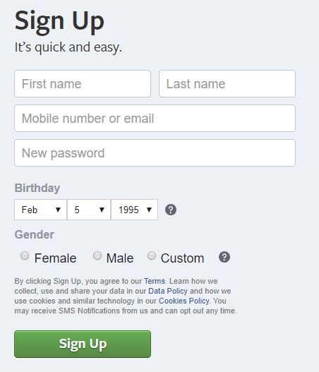
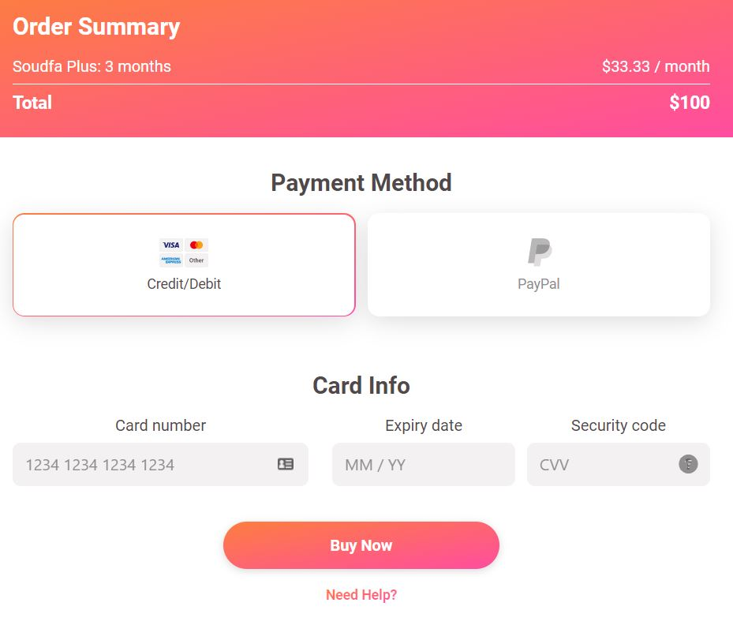
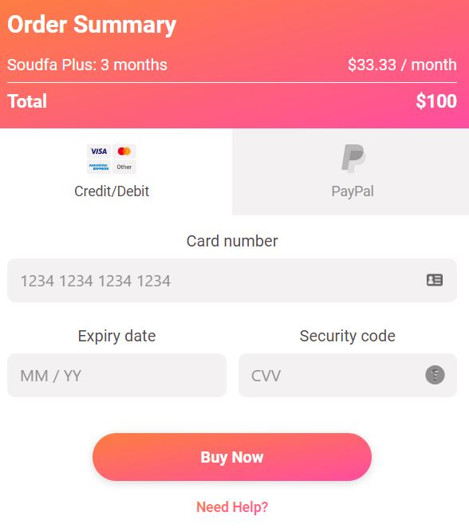

# Lesson plan
```
> Focus on having lots of in class exercises.

> DONT teach everything, let the students investigate topics on their own aswell!

> Focus on how to read documentation, google answers and google errors!!

> Teach towards the students being able to solve the homework
```

---

- [ ] Learn to use basic form - why do we have forms and what do they do?
  - [ ] form attributes: action and method (GET and POST)
  - [ ] [Code inspiration](#form-example)
  - [ ] Form control
    - [ ] Inputs (text, number, email, tel)
    - [ ] Checkboxes
    - [ ] Radio
    - [ ] Select
    - [ ] Textarea
    - [ ] File Select
    - [ ] Buttons
  - [ ] Label (explain how to connect to input, `for` with `id`)
  - [ ] [Exercise 1 - Facebook signup](#facebook-signup)
  - [ ] [Exercise 2 - Payment form](#payment-form)

# Inspiration

## Form example
```html
<body>
  <form action="https://telmore.dk" method="GET">
    <label for="mobile">Select Mobile</label>
    <input type="tel" id="mobile" />
    <input type="checkbox" name="check" id="asd" />
    <input type="radio" name="gender" id="" />
    <input type="radio" name="gender" id="" />
    <input type="radio" name="gender" id="" />
    <select name="vechicle">
      <option value="volvo">Volvo</option>
      <option value="fiat">Fiat</option>
      <option value="bmw">Bmw</option>
    </select>
    <textarea name="" id="" cols="30" rows="3"></textarea>
    <input type="file" name="" id="" />
    <button type="reset">Reset</button>
    <button type="submit">Submit</button>
    <button type="button">Click me</button>
  </form>
</body>

```

# Exercises

## Facebook signup
Recreate the following signup form using the [template found here](assets/exercise-template/fb-form)



## Payment form

Recreate the following payment form using the [template found here](assets/exercise-template/payment-form)

### Desktop


### Mobile


Implement one step at a time! 
1. First implement the section with order summary
2. Then payment method
3. Then Card info
4. And in the end the buy now and need help buttons

**Dont focus on colors borders, fonts, rounded corners, but focus on layout!**

Thank you for teaching the first module of the students ! For homework helpers, please click [here](https://forms.gle/LjihPmxGrmuEGDUy7) to give us feedback. For teachers, your survey is available [here](https://forms.gle/o5AKSkvGhC8uy6gh6). 
