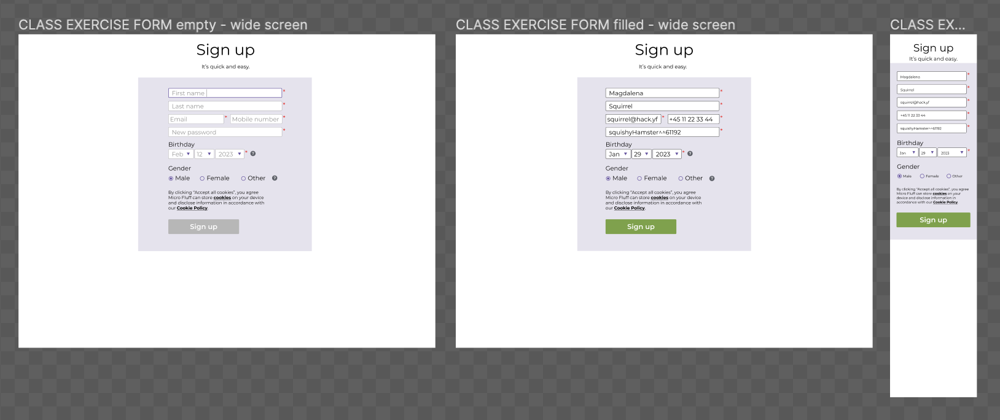

# Lesson plan

```
> Focus on having lots of in class exercises.

> DONT teach everything, let the students investigate topics on their own aswell!

> Focus on how to read documentation, google answers and google errors!!

> Teach towards the students being able to solve the homework
```

---

- A very short recap about forms
- Understanding and practising how to read a design file
- Building a form according to the design file

# Exercise

## Signup form



Design file: [figma](https://www.figma.com/file/p0EjktmcYDCkRAqLhMOCV0/HTML%2FCSS-week3?node-id=0%3A1&t=SO0wI0YVRHM6UFHg-0)

Read the design file and build a form that implements the design.

<br/>
<hr/>

Thank you for teaching the first module of the students ! For homework helpers, please click [here](https://forms.gle/LjihPmxGrmuEGDUy7) to give us feedback. For teachers, your survey is available [here](https://forms.gle/o5AKSkvGhC8uy6gh6).
