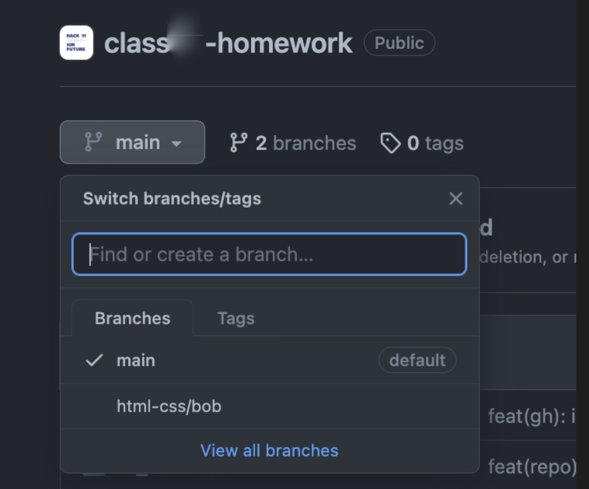
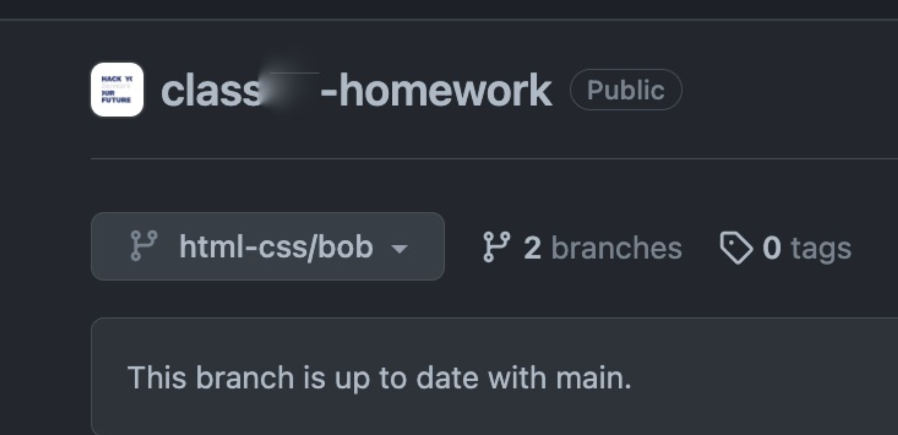
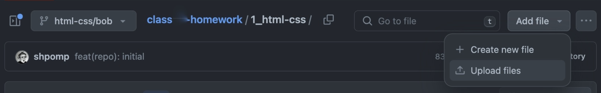

# How to submit the first homework?

While you have not gone through [Git](https://github.com/HackYourFuture-CPH/Git) yet, you will submit your first homework in a different way. This applies only to the first homework. If you are confident with basic Git already, feel free to do the submission in a proper version-control way.

`1.` go to your homework repository`*` on github and to the branches section:  

 
 

`2.` find the "New branch" button and create a new branch, that follows the naming convention:
`html-css/yourname`

> ❌ html/css/maria  
> ❌ hmtl-css/maria  
> ❌ html-css-homework  
> ❌ html/maria  
> ❌ htmlcss/maria  
> ✅ html-css/maria  

 
 

`3.` go to the branch. It appears in the branch overview right after creation:  

Or, if you are not there for some reason, go back to the repository overview and find your new branch in the drop-down:  

To verify that you have switched to the branch, it should appear selected:  

 
 

`4.` go to the html-css folder and upload your homework:  

 
 

`5.` write a commit message and press "Commit changes":  

 
 

`6.` go to "Pull requests" in the repository bar, and create a new pull request to the main branch <- from your branch:  

 
 

`7.` that is it! You should see your pull request listed in the "Pull requests" tab.

 
 

`8.` post a link to your homework Pull Request in your class channel.

 
 

`*` it is either your own homework repository in your own GitHub account or the central class homework repository in the HackYourFuture-CPH GitHub account - depending on what approach is being followed for your class. Follow the information and instructions regarding this, and ask if you are still unsure.
